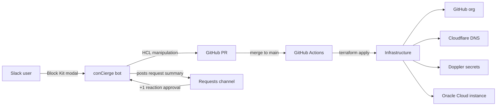
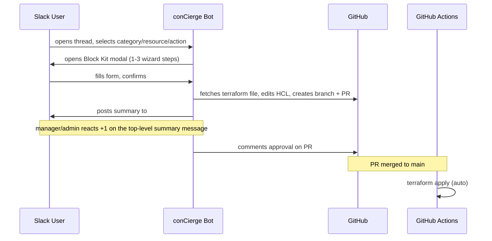

# conCierge

Monorepo for `jae-labs` infrastructure-as-code and the conCierge Slack bot that provides self-service GitOps workflows.

## Architecture



### Request lifecycle



## Repository Structure

```
.github/workflows/   # CI pipelines for bot and terraform
ansible/             # OCI host configuration (inventory, playbooks, roles)
src/           # conCierge Slack bot (Go)
terraform/
  github/            # GitHub org root module
  cloudflare/        # Cloudflare DNS root module
  doppler/           # Doppler secrets root module
  oci/               # Oracle Cloud root module
  modules/           # Reusable Terraform modules
  docs/              # Terraform documentation
  scripts/           # Bootstrap scripts
```

## Components

**[conCierge Slack Bot](src/)** — Go bot using the Slack Events API. Uses Socket Mode (WebSocket) for development, HTTP event subscriptions for production. Handles self-service workflows (repo CRUD, DNS records, org settings) via thread-keyed state machine and Block Kit modals. Produces PRs against the IaC in this repo, posts request summaries to `#concierge`, and records manager/admin approvals via reactions.

**[Terraform IaC](terraform/)** — Four root modules managing the `jae-labs` GitHub org, Cloudflare DNS, Doppler secrets, and OCI infrastructure. Remote state in GCS. Reusable modules live under `modules/` for GitHub, Cloudflare, and Doppler; OCI is a flat root module under `oci/`.

**[Ansible Host Config](ansible/)** — Manual-first Ansible layer for post-provision configuration of the OCI instance. Uses OCI dynamic inventory plus focused roles for host firewalling, nginx, certbot, and concierge bot deployment.

## CI/CD

All CI runs via GitHub Actions (`.github/workflows/`). Path-filtered: merging to `main` auto-applies Terraform per root module. The bot is built and tested on every PR touching `src/`.

## Prerequisites

- Go 1.25+
- Terraform >= 1.5
- `gcloud` CLI authenticated with GCS state bucket access
- Slack app with bot token; Socket Mode enabled for dev (app-level token), HTTP event subscriptions for production
- GitHub App with installation ID and private key
- Doppler CLI (optional, for local secret injection)

## Development

**Bot (live reload):**

```sh
cd src
air
```

**Bot (manual):**

```sh
cd src
go test ./...
go build ./cmd/concierge/
```

**Terraform:**

```sh
cd terraform/<module>
terraform init
terraform plan
```

**Ansible:**

```sh
cd ansible
bash bootstrap.sh
ansible-playbook -i inventory/oci.oci.yml playbooks/site.yml
```

The `concierge` Ansible role now builds the bot from `src/` for `linux/amd64`, installs it as `concierge.service`, and renders its runtime environment from Ansible variables on the host.
