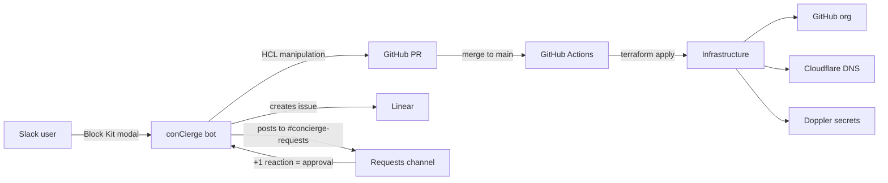
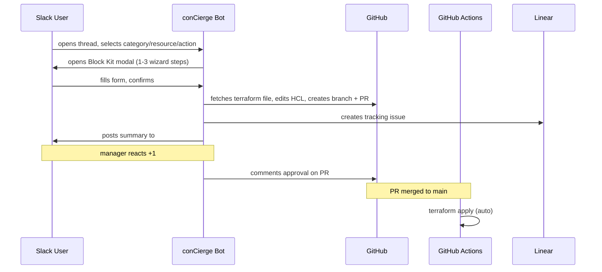

# conCierge

Monorepo for `jae-labs` infrastructure-as-code and the conCierge Slack bot that provides self-service GitOps workflows.

## Architecture



### Request lifecycle



## Repository Structure

```
.github/workflows/   # CI pipelines for bot and terraform
bot/slack/           # conCierge Slack bot (Go)
iac/terraform/
  github/            # GitHub org root module
  cloudflare/        # Cloudflare DNS root module
  doppler/           # Doppler secrets root module
  modules/           # Reusable Terraform modules
  docs/              # Terraform documentation
  scripts/           # Bootstrap scripts
```

## Components

**[conCierge Slack Bot](bot/slack/)** — Go bot using the Slack Events API. Uses Socket Mode (WebSocket) for development, HTTP event subscriptions for production. Handles self-service workflows (repo CRUD, DNS records, org settings) via thread-keyed state machine and Block Kit modals. Produces PRs against the IaC in this repo. Creates Linear issues for tracking, posts summaries to a requests channel for reaction-based approval. RBAC with user/manager/admin roles controls access and approval authority.

**[Terraform IaC](iac/terraform/)** — Three root modules managing the `jae-labs` GitHub org, Cloudflare DNS, and Doppler secrets. Remote state in GCS. Reusable modules under `modules/` (github, cloudflare, doppler).

## CI/CD

All CI runs via GitHub Actions (`.github/workflows/`). Path-filtered: merging to `main` auto-applies Terraform per root module. The bot is built and tested on every PR touching `bot/slack/`.

## Prerequisites

- Go 1.25+
- Terraform >= 1.5
- `gcloud` CLI authenticated with GCS state bucket access
- Slack app with bot token; Socket Mode enabled for dev (app-level token), HTTP event subscriptions for production
- GitHub App with installation ID and private key
- Linear API key and team ID
- Doppler CLI (optional, for local secret injection)

## Development

**Bot (live reload):**

```sh
cd bot/slack
air
```

**Bot (manual):**

```sh
cd bot/slack
go test ./...
go build ./cmd/concierge/
```

**Terraform:**

```sh
cd iac/terraform/<module>
terraform init
terraform plan
```
