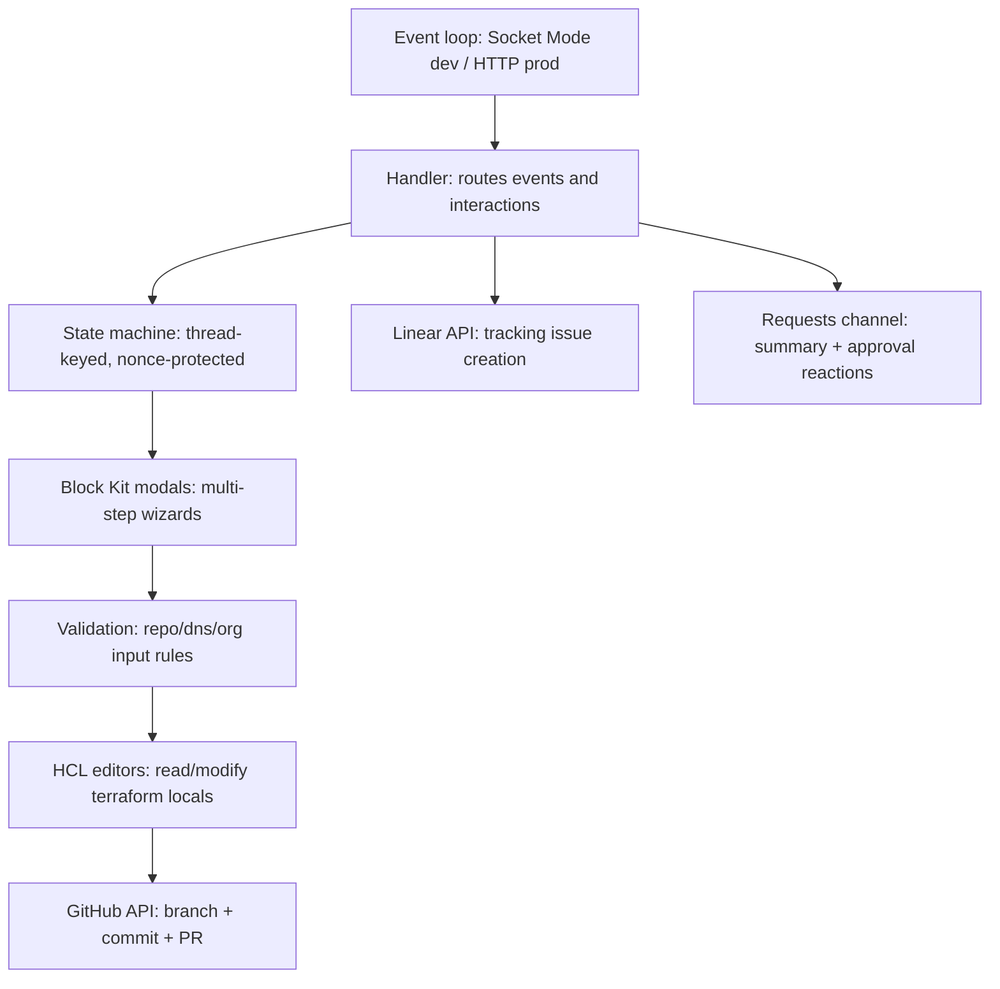
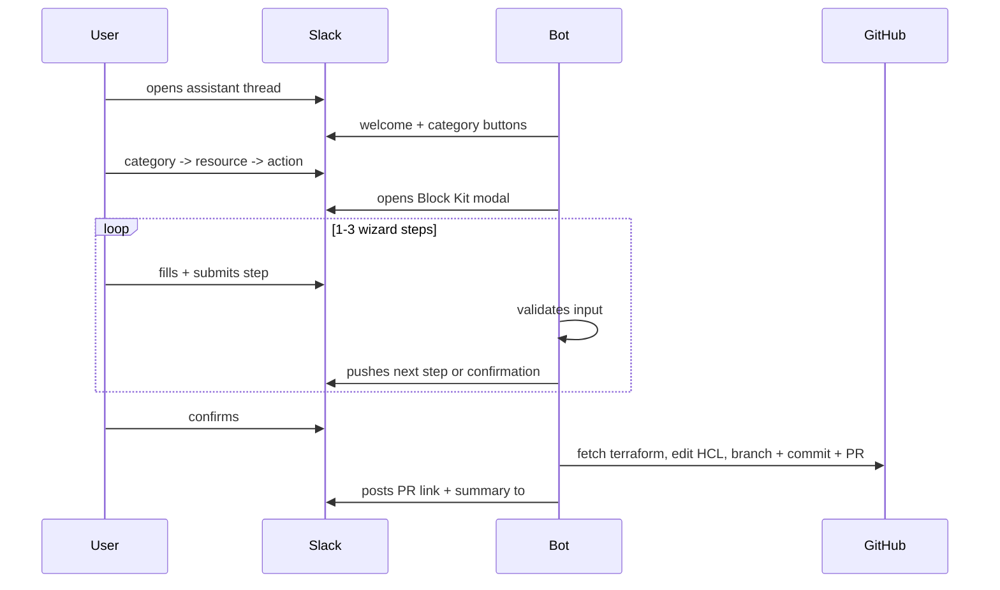

# conCierge Slack Bot

Go Slack bot providing self-service infrastructure workflows via Slack modals. Uses Socket Mode (WebSocket) for development and HTTP event subscriptions for production.

## What it does

- Create, update, and delete GitHub repositories
- Add, update, and delete Cloudflare DNS records
- Update GitHub org settings and repo settings (visibility, features, branch protection, team access)

Each workflow collects input via multi-step Block Kit modals, manipulates HCL in terraform locals files, creates a branch and PR via the GitHub API, creates a Linear tracking issue, and posts a summary to a Slack requests channel for reaction-based approval.

## Architecture



Terraform files live in `iac/terraform/` within this monorepo. The bot targets the `conCIerge` repo by default.

### Conversation flow



## Documentation

| Document | Description |
|---|---|
| [Architecture](docs/architecture.md) | Package map, state machine, request lifecycle, IaC coupling |
| [Adding a Resource Type](docs/adding-a-resource-type.md) | Step-by-step guide for adding new terraform resource support |
| [Validation Patterns](docs/validation-patterns.md) | Input validation rules per resource type |
| [Modals and Blocks](docs/modals-and-blocks.md) | Block Kit patterns, wizard flows, ID pairing |

## Supported workflows

| Category | Resource | Actions |
|---|---|---|
| GitHub | Repository | Add, Remove, Update |
| GitHub | Org Settings | Update |
| GitHub | User Management | Add to Team, Remove from Team, Change Role |
| Cloudflare | DNS Records | Add, Remove, Update |
| Doppler | — | Coming soon |

## RBAC

Three role tiers control access and approval:

| Role | Can use bot | Can approve requests |
|---|---|---|
| User (`SLACK_USER_IDS`) | Yes | No |
| Manager (`SLACK_MANAGER_IDS`) | Yes | Yes |
| Admin (`SLACK_ADMIN_IDS`) | Yes | Yes |

Approval is via `+1`/`:thumbsup:` reaction on the summary posted to `#concierge-requests`.

## Packages

| Package | Description |
|---|---|
| `internal/config` | Loads and validates environment variables |
| `internal/conversation` | Thread-keyed state machine; State, RepoConfig, DnsConfig, OrgConfig structs |
| `internal/github` | GitHub App authenticated client (branch, file, PR operations, PR templates) |
| `internal/hcl` | HCL text editors for reading and writing terraform locals files (repos, DNS, org) |
| `internal/linear` | Linear GraphQL client for creating tracking issues with priority mapping |
| `internal/slack` | Event handler (Socket Mode for dev, HTTP for prod), Block Kit modals, interaction routing, input validation |

## Environment variables

| Variable | Description |
|---|---|
| `SLACK_BOT_TOKEN` | Bot OAuth token (`xoxb-...`) |
| `SLACK_APP_TOKEN` | App-level token for Socket Mode (`xapp-...`); only needed for dev |
| `SLACK_REQUESTS_CHANNEL_ID` | Channel ID for posting request summaries and monitoring approvals |
| `SLACK_USER_IDS` | Comma-separated Slack user IDs (basic access) |
| `SLACK_MANAGER_IDS` | Comma-separated Slack user IDs (can approve requests) |
| `SLACK_ADMIN_IDS` | Comma-separated Slack user IDs (can approve requests) |
| `GITHUB_APP_ID` | GitHub App ID |
| `GITHUB_APP_INSTALLATION_ID` | GitHub App installation ID |
| `GITHUB_APP_PRIVATE_KEY` | GitHub App private key (PEM) |
| `GITHUB_OWNER` | GitHub organisation name |
| `GITHUB_REPO` | Terraform repo (default: `conCIerge`) |
| `LINEAR_API_KEY` | Linear API key for issue creation |
| `LINEAR_TEAM_ID` | Linear team ID for issue assignment |

Copy `.env.example` to `.env` and populate before running.

## Development

Live reload with [air](https://github.com/air-verse/air):

```sh
air
```

## Build and run

```sh
go build ./cmd/concierge/
./concierge
```

## Test

```sh
go test ./...
```
