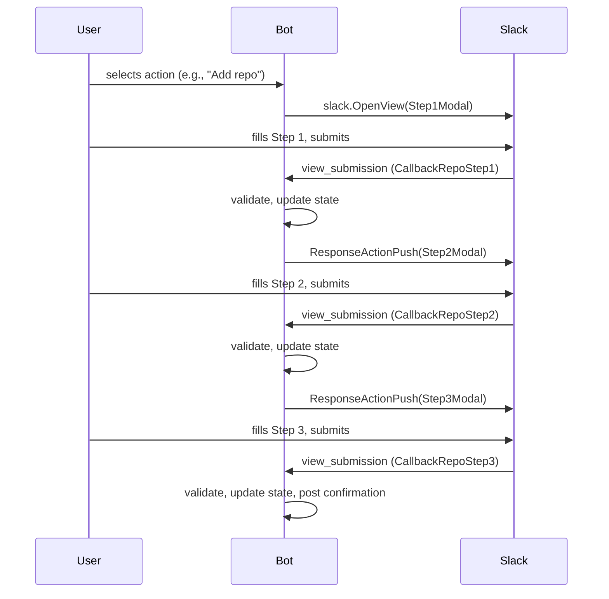
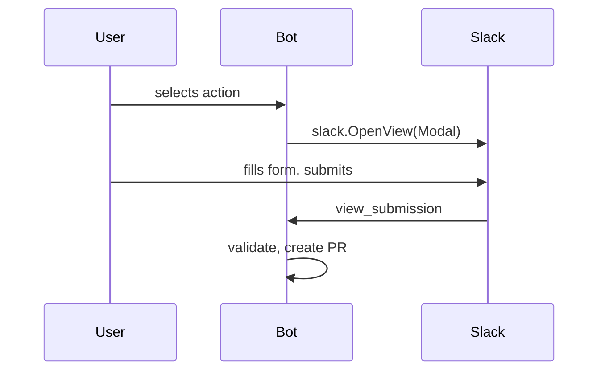

# Modals and Block Kit Patterns

How Block Kit modals, ID pairing, multi-step wizards, and confirmations work.

## Block/Elem ID pairing

Every form control has a paired constant:

- `Block*` -- the block (container) ID
- `Elem*` -- the element (form control) ID

Both are needed to read submission values:

```go
value := view.State.Values[BlockName][ElemName].Value
selected := view.State.Values[BlockVisibility][ElemVisibility].SelectedOption.Value
checked := len(view.State.Values[BlockProtection][ElemProtection].SelectedOptions) > 0
```

Constants are defined at the top of `blocks.go`. Dynamic IDs use a prefix:

```go
BlockTeamPrefix = "block_team_"  // + team name
ElemTeamPrefix  = "elem_team_"   // + team name
```

## Modal builder functions

All return `slack.ModalViewRequest`. Standard structure:

```go
func SomeModal(threadTS, nonce string, ...) slack.ModalViewRequest {
    return slack.ModalViewRequest{
        Type:            slack.VTModal,
        CallbackID:      CallbackSomething,
        Title:           slack.NewTextBlockObject("plain_text", "Title", false, false),
        Submit:          slack.NewTextBlockObject("plain_text", "Submit", false, false),
        Close:           slack.NewTextBlockObject("plain_text", "Cancel", false, false),
        PrivateMetadata: threadTS + ":" + nonce,
        Blocks:          slack.Blocks{BlockSet: blocks},
    }
}
```

`PrivateMetadata` format: `"threadTS:nonce"` -- parsed back in handler to find state and validate nonce.

## Multi-step wizard pattern

Used for repos (3 steps). Each step is a separate modal pushed onto Slack's view stack:



Push response:

```go
resp := slack.NewViewSubmissionResponse()
resp.ResponseAction = "push"
resp.View = nextModal
```

## Single-step modal pattern

Used for DNS add, DNS remove, org settings, team member actions. One modal, one submission:



## Dynamic blocks

Team role dropdowns are generated dynamically from available teams:

```go
func teamRoleBlocksDefault(teams []string) []slack.Block
func teamRoleBlocks(teams []string, existing map[string]string) []slack.Block
```

`teamRoleBlocksDefault` creates a dropdown per team defaulting to "pull".
`teamRoleBlocks` creates a dropdown per team pre-selected with existing permission.
`parseTeamRoleValues()` reads the submitted values back (skips "none").

## Shared request metadata blocks

Most request modals also reuse shared blocks for:

- `requestPriorityBlock()` -- collects low/medium/high priority
- `BlockJustification` / `ElemJustification` -- captures why the change is needed

## Locked blocks

After a user selects category/resource/action, the interactive buttons are replaced with static text:

```go
LockedCategoryBlocks(categoryLabel string) []slack.Block
LockedResourceBlocks(category, resourceLabel string) []slack.Block
LockedActionBlocks(actionLabel string) []slack.Block
```

This prevents re-interaction with previous steps. Original message timestamp is tracked in `State.Messages`.

## Confirmation and summary

**Create flows**: Summary builders format collected config as readable text. `RepoCreateSummary` takes ~18 positional parameters (name, description, visibility, topics, teamAccess, etc.):

```go
func RepoCreateSummary(name, description, visibility string, topics []string, teamAccess map[string]string, ...) string
func DnsAddSummary(zone string, cfg conversation.DnsConfig, justification string) string
```

**Edit flows**: Show diff between old and new config:

```go
func RepoSettingsSummary(repoName string, oldCfg, newCfg conversation.RepoConfig, justification string) string
func DnsUpdateSummary(zone string, oldCfg, newCfg conversation.DnsConfig, justification string) string
func OrgSettingsSummary(oldCfg, newCfg conversation.OrgConfig, justification string) string
```

## Existing modals reference

| Resource | Action | Callback | Modal function | Steps |
|---|---|---|---|---|
| Repo | Add | CallbackRepoStep1/2/3 | RepoStep1Modal, RepoStep2Modal, RepoStep3Modal | 3 |
| Repo | Delete | CallbackDeleteRepo | DeleteRepoModal | 1 |
| Repo | Settings | CallbackSelectRepo, CallbackSettingsStep1/2/3 | SelectRepoModal, SettingsStep1/2/3Modal | 1 + 3 |
| DNS | Add | CallbackDnsAdd | DnsAddModal | 1 |
| DNS | Delete | CallbackDnsRemove | DnsRemoveModal | 1 |
| DNS | Update | CallbackDnsSelectRecord, CallbackDnsUpdate | DnsSelectRecordModal, DnsUpdateModal | 1 + 1 |
| Org | Settings | CallbackOrgSettings | OrgSettingsModal | 1 |
| Members | Add | CallbackTeamMemberAdd | TeamMemberAddModal | 1 |
| Members | Remove | CallbackTeamMemberRemove | TeamMemberRemoveModal | 1 |
| Members | Change role | CallbackTeamMemberChangeRole | TeamMemberChangeRoleModal | 1 |

## Adding a new modal

1. Add callback constant (e.g., `CallbackNewThing = "new_thing"`)
2. Add Block/Elem ID pairs for each form field
3. Write modal builder function returning `slack.ModalViewRequest`
4. Add submission handler in `handleViewSubmission()` matching CallbackID
5. Write validation function
6. Write summary builder for confirmation
