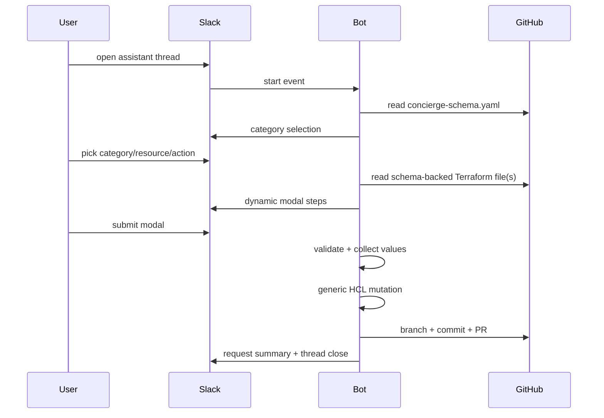

# Architecture

## Package map

| Package | Responsibility |
|---|---|
| `cmd/concierge` | bootstrap runtime |
| `internal/config` | env parsing |
| `internal/conversation` | thread state + nonce protection |
| `internal/github` | file reads, branch/update/PR creation, commit author |
| `internal/hcl` | generic Terraform locals read/write |
| `internal/schema` | `concierge-schema.yaml` parsing + validation |
| `internal/slack` | Slack event handling and dynamic modal flow |
| `internal/observability` | shared logger, OTel runtime, metrics handler lifecycle |

## Observability topology

- App logs use `slog`.
- App traces and metrics use OpenTelemetry.
- Grafana Alloy is the only collector on the host.
- Loki receives app logs by tailing the Nomad allocation stdout/stderr files.
- Tempo receives traces through Alloy OTLP ingest.
- Sentry receives exceptions/errors forwarded via Grafana Alloy from app logs rather than direct SDK capture.
- Grafana Alloy performs stateful, tail-based trace sampling on `conCIerge` traces (keeping all error traces, all slow traces > 1s, and a 1% baseline sample of remaining traces) before forwarding them to Tempo/Honeycomb/Sentry.

Application instrumentation stays vendor-neutral while preserving Sentry-native issue handling.

## Request lifecycle

## State machine

`State` tracks:

- thread/channel/user
- nonce
- category/resource/action
- generic `DynamicConfig`
- selected target key
- tracked Slack message timestamps

State is in-memory and deleted on cancel or successful PR creation.

## Dynamic contract

`terraform/concierge-schema.yaml` defines:

- category list and order
- resource list and category mapping
- resource kind: `map_entry`, `singleton`, `membership`
- terraform file path (`file:` per resource)
- root map/object path (`root_path:` per resource)
- supported actions
- wizard steps
- field metadata and dynamic option sources

Go stays generic. New schema-backed resources do not require new Slack handlers or modal builders.

## HCL engine

`internal/hcl/dynamic_editor.go` provides generic operations:

- `ExistingResourceKeys`
- `ReadResource`
- `ReadSingleton`
- `AddResource`
- `UpdateResource`
- `UpdateSingleton`
- `RemoveResource`

`singleton` and `map_entry` updates share `applyUpdates` (different base indents: `singletonIndent` and `mapEntryIndent`).

`membership` resources use the generic membership primitive in `internal/hcl/membership_editor.go`.

All writes parse input and output HCL.
