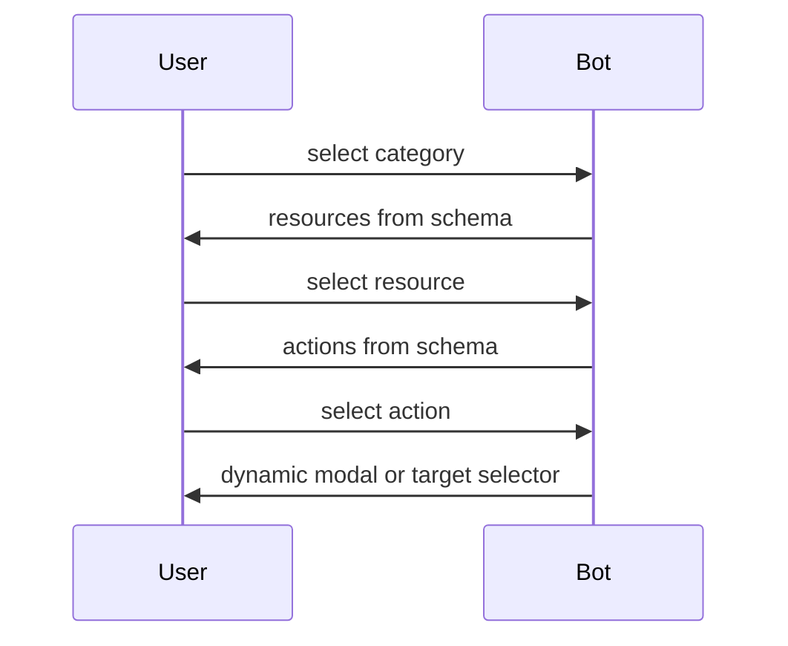

# Modals and Block Kit Patterns

## Dynamic modal model

Schema-backed modals are built from YAML steps and fields. The handlers in
`internal/slack/dynamic_blocks.go` and `submission.go` are the single
implementation; no resource-specific modal builders exist.

Entry points:

- `BuildDynamicModal(...)`
- `BuildDynamicSelectModal(...)`

## Callback model

Dynamic callback IDs and their constants:

| Constant | ID |
|---|---|
| `CallbackDynamicSelectTarget` | `dynamic_select_target` |
| `callbackDynamicCreatePrefix` | `dynamic_create_step_` |
| `callbackDynamicUpdatePrefix` | `dynamic_update_step_` |

Use `dynamicCallback{Mode: flowCreate, Step: 1}.String()` to compose IDs and
`parseDynamicCallback(id)` to parse inbound IDs. The parser returns `(zero, false)`
for any non-step callback, so the dispatcher falls through cleanly.

`PrivateMetadata` format is `threadTS:nonce`. The state resolver checks the
nonce against the in-memory state and silently drops mismatches.

## Selection flow

## Block / element ID conventions

All IDs are derived from schema paths and built through helpers in `ids.go`:

- scalar/select fields: `fieldBlockID(path)` / `fieldElemID(path)`
- map_string fields: `mapEntryBlockID(path, key)` / `mapEntryElemID(path, key)`
- resource key selector: `BlockResourceKey` / `ElemResourceKey`
- justification: `BlockJustification` / `ElemJustification`

Never hand-roll ID strings; use the helpers so validation, parsing, and tests
stay in sync.

## Field types

Current generic field types:

- `string`
- `integer`
- `number`
- `boolean`
- `select`
- `list_string`
- `list_integer`
- `map_string`

## Locked messages

Interactive category/resource/action messages are replaced with static locked blocks after selection:

- `LockedCategoryBlocks`
- `LockedResourceBlocks`
- `LockedActionBlocks`
- `LockedConfirmationBlocks`
- `FlowEndedBlocks`

The dispatch table lives in `summary.go:lockedBlocksFor`.

## Rule

Do not add resource-specific modal builders for schema-backed resources. Extend dynamic blocks instead.
