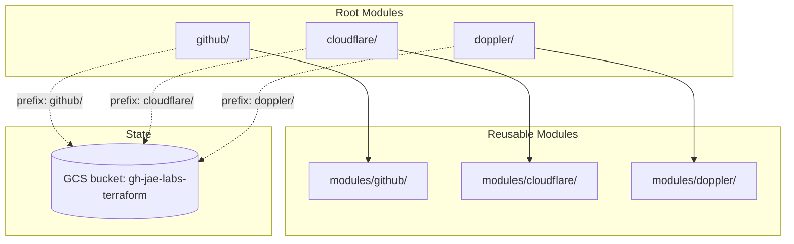

# Terraform

IaC for managing the [jae-labs](https://github.com/jae-labs) GitHub organization, Cloudflare DNS, and Doppler secrets.

## Architecture



Each root module has independent state stored in GCS with per-module prefix. No cross-module dependencies.

## Documentation

| Document | Description |
|---|---|
| [GitHub Module](docs/github-module.md) | Org members, teams, repos, branch protection, environments |
| [Cloudflare Module](docs/cloudflare-module.md) | DNS zones, records, account members |
| [Doppler Module](docs/doppler-module.md) | Projects, environments, groups, access grants |
| [CI/CD](docs/ci-cd.md) | GitHub Actions workflows, secrets, SHA ratcheting |
| [Bootstrap](docs/bootstrap.md) | One-time GCS backend setup |

## Prerequisites

- Terraform >= 1.5
- `GITHUB_TOKEN` env var (fine-grained PAT with org admin + repo admin + members read/write)
- `CLOUDFLARE_API_TOKEN` env var (API token with zone/DNS edit permissions)
- `DOPPLER_TOKEN` env var (personal token from Doppler account settings)
- `GOOGLE_APPLICATION_CREDENTIALS` pointing to a GCP service account key for GCS backend

## Usage

```bash
# first time only
bash scripts/bootstrap.sh

# github
cd github
terraform init
terraform plan
terraform apply

# cloudflare
cd cloudflare
terraform init
terraform plan
terraform apply

# doppler
cd doppler
terraform init
terraform plan
terraform apply
```

## Adding a repo

The conCierge bot automates repo creation via Slack. For manual additions, edit `github/locals_repos.tf` directly under `repos`, then push to `main` — the GitHub Action applies automatically.

## CI/CD

Merges to `main` trigger path-filtered `terraform apply` via GitHub Actions. Each root module has a dedicated workflow (`github-apply.yml`, `cloudflare-apply.yml`, `doppler-apply.yml`) calling a shared `terraform-reusable.yml`. Workflows live in `.github/workflows/` at the repo root and use a `production` environment with protected secrets.
